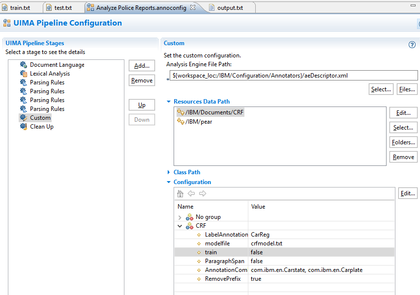
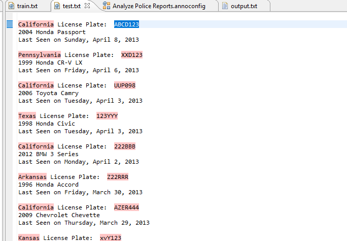

# UIMA2CRF 

UIMACRF Is a UIMA plugin for Watson Content Analytics that use Mallet Conditional Random Field to train on existing documents and then create annotations for new documents using Mallet machine learning http://mallet.cs.umass.edu/  . All of this code can run on premise.
The source code for the UIMA Custom plugin is in the UIMA2CRF Folder which contains the Eclipse project export. 
Change the logic in the Annotation2CRF.java code if you want another labeling logic than a combination of 2 annotations in a paragraph or sentence. 

The component for WCA studio are in the WCA folder. Add these components to the initial WCA Studio IBM project that contains police reports. 
Click on the configuration and edit the custom component in the pipeline.  Select train to true on the document. As an example the custom components look for combination of annotations in a sentence or a paragraph (Carplate and Carstate in this case). 
Select the appropriate labeling span (paragraph or sentence) in the customization screen.

Use https://github.ibm.com/marc-fiammante/UIMA2CRF/blob/master/WCA/train.txt as the first document and run analyze document.
A CRFtrain.txt file is created see https://github.ibm.com/marc-fiammante/UIMA2CRF/blob/master/WCA/CRF/CRFtrain.txt. The machine learning model file is created in the same folder with the name given in the same folder, do not edit it.
The log result of the the Mallet CRF training is captured in the file log.txt. 
Then switch to the test.txt document and in the custom component configuration switch from train true to false. 
Analyze the test.txt document and you will see on the right that a com.ibm.CRF annotation is created with the combinations found by mallet CRF. 
The result of mallet Simple tagger process is captured in this file https://github.ibm.com/marc-fiammante/UIMA2CRF/blob/master/WCA/CRF/output.txt which is processed by the plugin to create the annotation in WCA.

Future plans are to add support for brat for labeling  http://brat.nlplab.org/index.html it would require loading a standoff format from that java code http://brat.nlplab.org/standoff.html.

